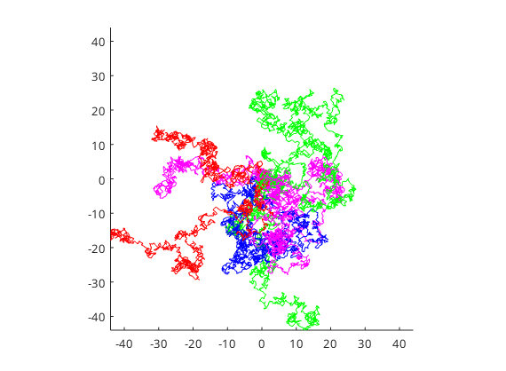

### drunken walker's path

```matlab
% kinda drunken walk
% large amount of plot specific stuff

clc;clear;clf;
pause on; % should be in on state to be able to use the pause function
hold on;
REP=10;
N=1000;
GS=55; % <N, large->fast plot
col=["r","g","m","b"];

plot(0,0,"Ok");
L=44;
xlim([-L,L]);xlim("manual");
ylim([-L,L]);ylim("manual");
axis square

for r=1:REP
   c=col(mod(r,length(col))+1);
   steps=2*rand(2,N)-1; % rand numbers bw. -1 and 1
   path=cumsum(steps,2); % 2->row cumsum computed
   k=1;
   while k+GS<=N
      plot(path(1,k:k+GS),path(2,k:k+GS),c);
      pause(0.05);
      k=k+GS;
   end
end
```



